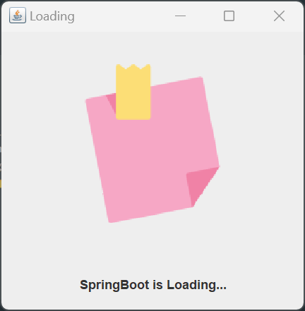
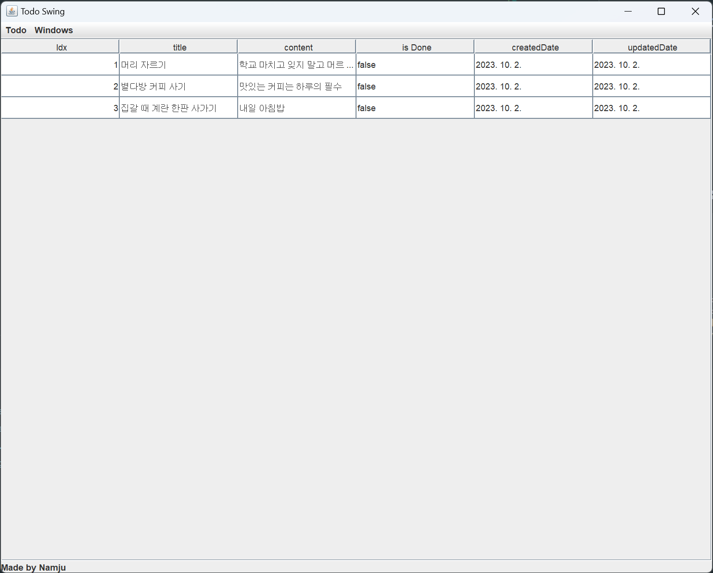
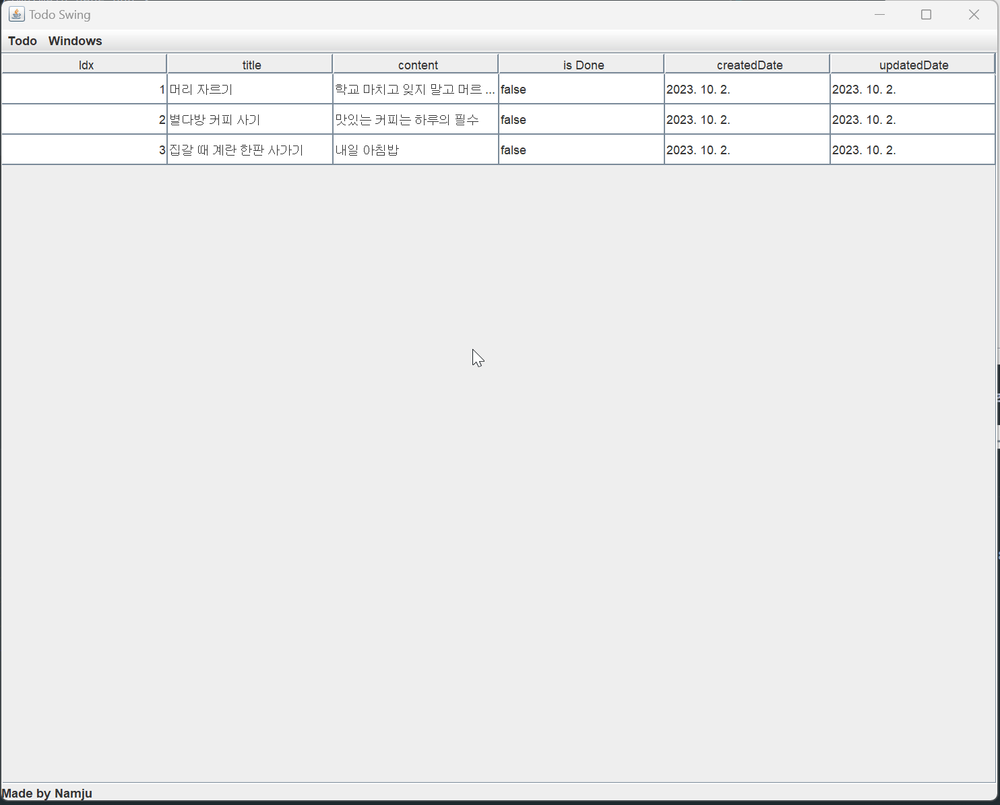
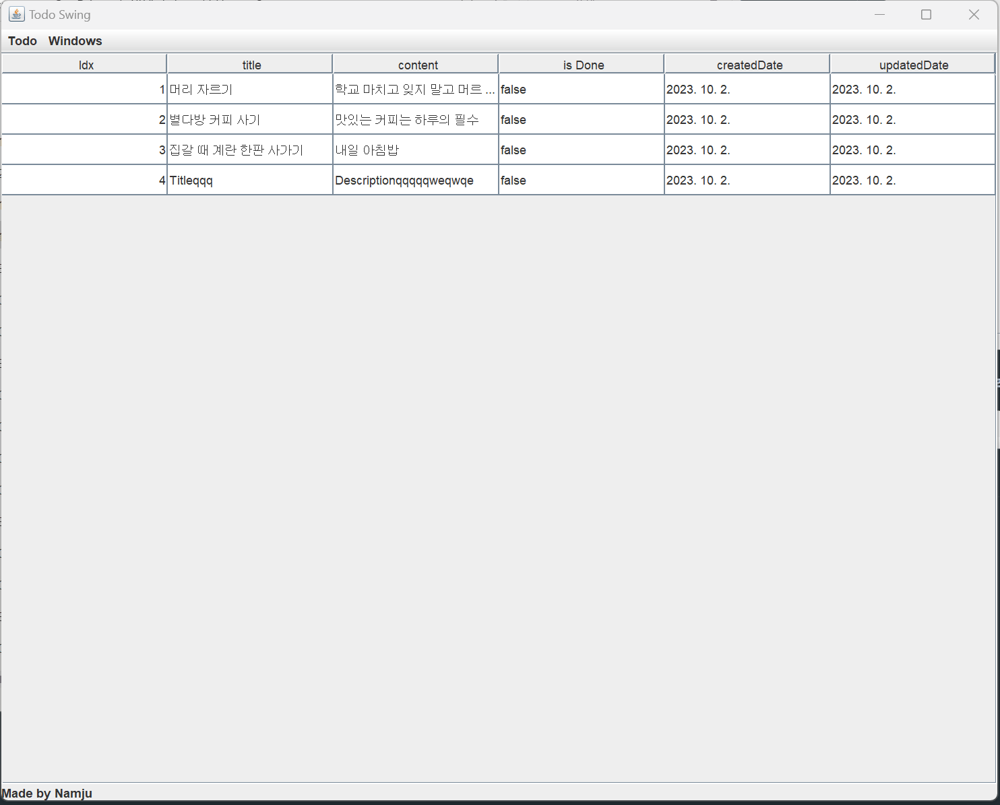
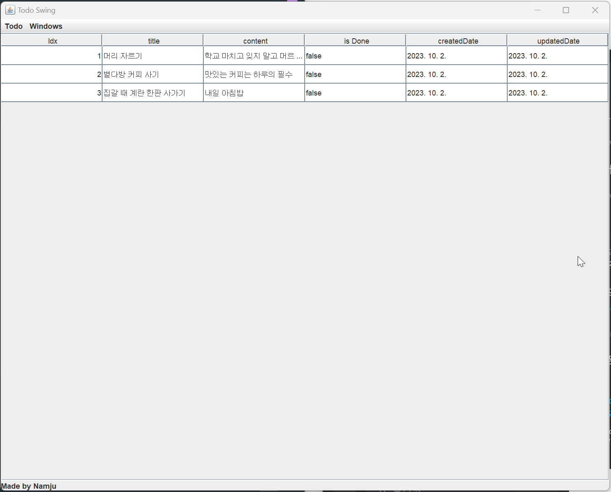
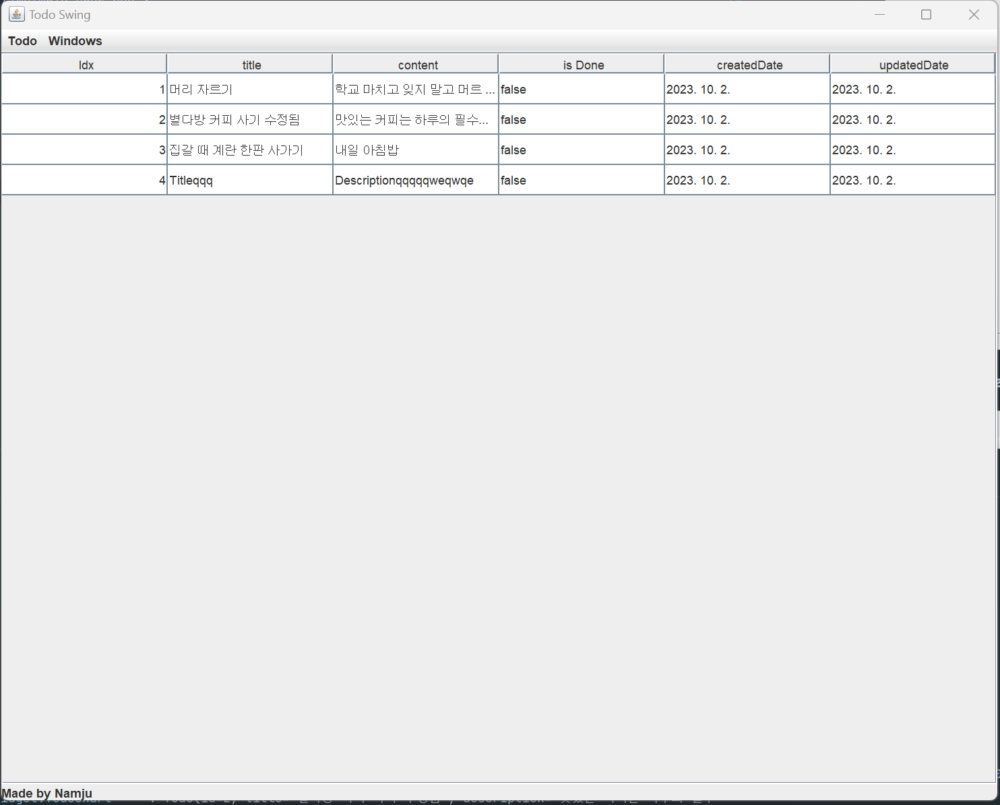

# Swing(kotlin)을 활용한 TodoList 구현

## 1. 프로젝트 목표

- Swing을 활용한 TodoList 구현
- SpringBoot와 연동하여 TodoList 데이터 관리
    - Spring Data JPA를 활용하여 간단한 CRUD 구현
- Java대신 Kotlin을 활용하여 개발
    - Java와 Kotlin의 차이점을 이해하고, Kotlin의 장점을 활용하여 개발
    - init, object, companion object, data class등을 활용하여 개발

## 2. 프로젝트 구조

### 2.1. 개발 환경

- Kotlin 1.8.22
- Java 17
- SpringBoot 3.1.4
- h2 Database
- IntelliJ IDEA
- Gradle

### 2.2. 프로젝트 구조

```text
📦todo_swing
 ┣ 📂src
 ┃ ┣ 📂main
 ┃ ┃ ┣ 📂kotlin
 ┃ ┃ ┃ ┗ 📂com
 ┃ ┃ ┃ ┃ ┗ 📂gulio
 ┃ ┃ ┃ ┃ ┃ ┗ 📂todo_swing
 ┃ ┃ ┃ ┃ ┃ ┃ ┣ 📂configuration
 ┃ ┃ ┃ ┃ ┃ ┃ ┃ ┗ 📜ApplicationContextProvider.kt
 ┃ ┃ ┃ ┃ ┃ ┃ ┣ 📂entity
 ┃ ┃ ┃ ┃ ┃ ┃ ┃ ┗ 📜Todo.kt
 ┃ ┃ ┃ ┃ ┃ ┃ ┣ 📂repository
 ┃ ┃ ┃ ┃ ┃ ┃ ┃ ┗ 📜TodoRepository.kt
 ┃ ┃ ┃ ┃ ┃ ┃ ┣ 📂view
 ┃ ┃ ┃ ┃ ┃ ┃ ┃ ┣ 📂widget
 ┃ ┃ ┃ ┃ ┃ ┃ ┃ ┃ ┣ 📜CustomMenu.kt
 ┃ ┃ ┃ ┃ ┃ ┃ ┃ ┃ ┣ 📜CustomPopupMenu.kt
 ┃ ┃ ┃ ┃ ┃ ┃ ┃ ┃ ┗ 📜TodoChart.kt
 ┃ ┃ ┃ ┃ ┃ ┃ ┃ ┣ 📜LoadingPage.kt
 ┃ ┃ ┃ ┃ ┃ ┃ ┃ ┣ 📜MainPage.kt
 ┃ ┃ ┃ ┃ ┃ ┃ ┃ ┣ 📜RefreshController.kt
 ┃ ┃ ┃ ┃ ┃ ┃ ┃ ┗ 📜TodoForm.kt
 ┃ ┃ ┃ ┃ ┃ ┃ ┗ 📜TodoSwingApplication.kt
 ┃ ┃ ┗ 📂resources
 ┃ ┃ ┃ ┣ 📂image
 ┃ ┃ ┃ ┃ ┗ 📜loading_image.png
 ┃ ┃ ┃ ┣ 📂static
 ┃ ┃ ┃ ┣ 📂templates
 ┃ ┃ ┃ ┣ 📜application.yaml
 ┃ ┃ ┃ ┗ 📜data.sql
```

### 2.3. 프로젝트 특징

+ 느슨한 결합(Loose Coupling)
  + 'RefreshController.kt' 인터페이스에서 "refresh()" 메소드를 정의하고, 이를 구현한 "TodoChart" 에서 각각의 기능을 구현하였다.
  + 이를 통해 다른 클래스에서 "RefreshController" 인터페이스를 통해 "TodoChart"의 기능을 사용할 수 있게 되었다.
  
## 3. 프로젝트 결과

### 3.0. 실행

> 로딩 화면과 함께 SpringBoot가 실행된다.



```bash
"C:\Program Files\Java\jdk-17\bin\java.exe" 

.   ____          _            __ _ _
/\\ / ___'_ __ _ _(_)_ __  __ _ \ \ \ \
( ( )\___ | '_ | '_| | '_ \/ _` | \ \ \ \
\\/  ___)| |_)| | | | | || (_| |  ) ) ) )
'  |____| .__|_| |_|_| |_\__, | / / / /
=========|_|==============|___/=/_/_/_/
:: Spring Boot ::                (v3.1.4)

2023-10-02T04:33:54.266+09:00  INFO 1564 --- [           main] c.g.todo_swing.TodoSwingApplicationKt    : Starting TodoSwingApplicationKt using Java 17.0.8 with PID 1564 (D:\Projects\todo_swing\build\classes\kotlin\main started by cmson in D:\Projects\todo_swing)
2023-10-02T04:33:54.269+09:00  INFO 1564 --- [           main] c.g.todo_swing.TodoSwingApplicationKt    : No active profile set, falling back to 1 default profile: "default"
2023-10-02T04:33:54.748+09:00  INFO 1564 --- [           main] .s.d.r.c.RepositoryConfigurationDelegate : Bootstrapping Spring Data JPA repositories in DEFAULT mode.
2023-10-02T04:33:54.783+09:00  INFO 1564 --- [           main] .s.d.r.c.RepositoryConfigurationDelegate : Finished Spring Data repository scanning in 29 ms. Found 1 JPA repository interfaces.
2023-10-02T04:33:55.105+09:00  INFO 1564 --- [           main] o.s.b.w.embedded.tomcat.TomcatWebServer  : Tomcat initialized with port(s): 8080 (http)
2023-10-02T04:33:55.113+09:00  INFO 1564 --- [           main] o.apache.catalina.core.StandardService   : Starting service [Tomcat]
```

### 3.1. TodoList

> Spring Data JPA를 활용하여 TodoList를 가져온다.



```bash
Hibernate: 
    select
        t1_0.id,
        t1_0.created_at,
        t1_0.description,
        t1_0.status,
        t1_0.title,
        t1_0.updated_at 
    from
        todo t1_0
2023-10-02T04:33:56.731+09:00  INFO 1564 --- [           main] c.g.todo_swing.view.widget.TodoChart     : Todo(id=1, title='머리 자르기', description='학교 마치고 잊지 말고 머르 자르기', status=false, createdAt=2023-10-02 04:33:56.55495, updatedAt=2023-10-02 04:33:56.55495)
2023-10-02T04:33:56.731+09:00  INFO 1564 --- [           main] c.g.todo_swing.view.widget.TodoChart     : Todo(id=2, title='별다방 커피 사기', description='맛있는 커피는 하루의 필수', status=false, createdAt=2023-10-02 04:33:56.55495, updatedAt=2023-10-02 04:33:56.55495)
2023-10-02T04:33:56.731+09:00  INFO 1564 --- [           main] c.g.todo_swing.view.widget.TodoChart     : Todo(id=3, title='집갈 때 계란 한판 사가기', description='내일 아침밥', status=false, createdAt=2023-10-02 04:33:56.55495, updatedAt=2023-10-02 04:33:56.55495)
```

### 3.2. TodoList 추가



### 3.3. TodoList 수정



### 3.4. TodoList 완료



### 3.5. TodoList 삭제


